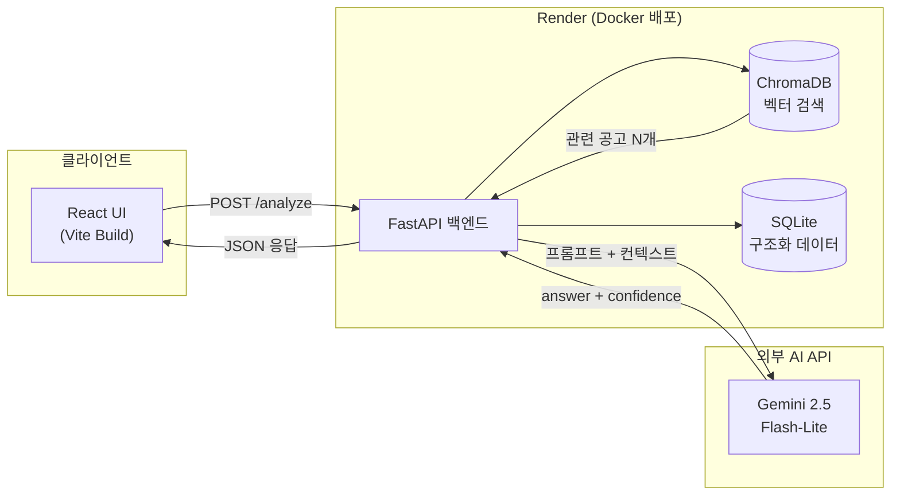

# CareerFit AI

> 취업·공모전 데이터 기반 맞춤형 AI 포트폴리오 코치

## 프로젝트 개요

취업 준비생과 공모전 지원자는 자신의 전공·스킬이 실제 채용 공고에서 요구하는 역량과 얼마나 부합하는지 판단하기 어렵고, 막연히 스펙만 쌓는 데 시간을 쓰는 경우가 많습니다. **CareerFit AI**는 사용자가 입력한 전공·보유 스킬·희망 직무를 실제 채용 공고 및 공모전 데이터와 매칭하여, 부족한 역량과 보완 방향을 참고 공고(출처)와 함께 제시하는 AI 코칭 서비스입니다.

이를 위해 채용 공고 데이터를 벡터 DB(ChromaDB)에 저장하고, 사용자 입력과 의미적으로 유사한 공고를 검색(RAG)한 뒤 Gemini 모델이 검색된 공고를 근거로 맞춤형 분석 답변을 생성하는 구조로 구현했습니다.

## 기술 스택

| 영역 | 기술 |
|---|---|
| 백엔드 | Python 3.11, FastAPI |
| AI API | Gemini 2.5 Flash-Lite |
| 데이터 | Pandas, SQLite, ChromaDB |
| 프론트엔드 | React, Vite |
| 실행 환경 | Docker |
| 배포 | Render (Docker 기반) |

## 아키텍처



## 실행 방법

### 1. 백엔드 (FastAPI)

```bash
cd backend
python -m venv venv
source venv/bin/activate   # Windows: venv\Scripts\activate
pip install -r requirements.txt
```

`backend/.env.example`을 복사해 `.env` 생성 후 `GEMINI_API_KEY`, `FRONTEND_ORIGINS` 값을 입력합니다.

데이터 전처리 (최초 1회 필요):
```bash
python data/preprocess.py
```

서버 실행:
```bash
uvicorn main:app --host 0.0.0.0 --port 8000 --reload
```

- API 문서: http://localhost:8000/docs

### 2. 프론트엔드 (React/Vite)

```bash
cd frontend
npm install
```

`frontend/.env.example`을 복사해 `.env` 생성 후 `VITE_API_BASE_URL=http://localhost:8000` 입력.

```bash
npm run dev
```

- 접속 주소: http://localhost:5173

### 3. Docker로 백엔드 실행 (선택)

```bash
docker build -t careerfit-ai ./backend
docker run -p 8000:8000 --env-file backend/.env careerfit-ai
```

## 주요 기능

- **RAG 기반 역량 분석**: 사용자 입력(전공·스킬·희망 직무)과 실제 채용 공고 데이터를 벡터 검색으로 매칭하여 맞춤형 분석 답변 생성
- **출처 표시**: 분석에 참고한 공고를 `sources`로 함께 반환하여 근거를 투명하게 노출
- **신뢰도 표시**: 분석 결과의 신뢰도(`confidence`)를 색상으로 구분해 시각적으로 안내
- **Mock Mode**: `MOCK_MODE=true` 환경변수로 Gemini API 호출 없이 목업 응답을 반환하는 폴백 모드 [실제 동작 확인 후 유지/삭제]
- **UI 상태 처리**: empty / loading / success / error / no-sources 5가지 상태를 모두 명시적으로 처리

## 데이터 파이프라인

```
CSV → Pandas 전처리 → SQLite (구조화 저장) → ChromaDB (벡터 검색)
```

| 단계 | 도구 | 설명 |
|---|---|---|
| 수집 | CSV | 제공 목업 데이터 + 개인화 데이터 |
| 전처리 | Pandas | 결측치 처리, 중복 제거, 기술 스택(Skills) 명칭 표준화 |
| 구조화 저장 | SQLite | 조건부 필터링·조회를 위한 관계형 DB 적재 |
| 벡터 저장 | ChromaDB | 의미 기반 검색(RAG)을 위한 텍스트 임베딩 적재 |

## 프로젝트 구조

```
careerfit-ai/
├── backend/          # FastAPI 서버
│   ├── main.py
│   ├── routers/
│   ├── services/
│   ├── data/
│   └── Dockerfile
├── frontend/         # React UI
│   ├── src/
│   └── Dockerfile
└── docs/             # 배포·설계 문서
```

## 한계 및 향후 검증 계획

현재까지는 기능 단위 수동 테스트로 동작을 확인했으며, 정량적인 응답 품질 평가는 진행하지 않았습니다.

- [ ] RAG 검색 품질 평가 (Ragas 등 지표 도입)
- [ ] 매칭 정확도에 대한 정성 평가 (샘플 케이스 기준)
- [ ] 응답 지연시간 측정

## 진행 현황

- [x] 1일차: 프로젝트 기획 및 개발 환경 세팅
- [x] 2일차: FastAPI 서버 구축 및 Gemini API 연결
  - `/health`, `/jobs`, `/analyze` 엔드포인트 구현
  - 환경변수 기반 Mock Mode 설정
- [x] 3일차: 데이터 파이프라인 구축 및 프로젝트 구조화
  - `preprocess.py` 작성, `jobs.csv` 구성
  - Gemini 프롬프트 설계 및 API 호출 테스트
- [x] 4일차: RAG 기반 서비스 + React UI
  - ChromaDB 검색 기반 RAG 파이프라인 구축 (`rag_service.py`)
  - Gemini 컨텍스트 결합 프롬프트 및 답변 생성 로직 (`llm_service.py`)
  - React + Vite 프론트엔드 구현 (`InputForm`, `ResultCard`, `SourceCard`)
  - UI 상태 처리(empty/loading/success/error/no-sources) 구현
- [x] 5일차: Docker 배포 안정화 및 포트폴리오 완성
  - [x] 백엔드 Docker 배포 (Render)
  - [x] 프론트엔드 Docker 배포 (Render) — 환경변수 기반 API 주소 연동 확인 중

## 🔮 향후 개선

- [ ] 이력서 PDF 업로드 후 자동 역량 추출
- [ ] 공모전 마감일 알림 기능
- [ ] RAG 검색 품질 평가 지표 추가 (Ragas 등)

## 개발 과정에서 어려웠던 점
프론트엔드 배포 후 API 주소가 로컬로 하드코딩되어 있던 문제를 환경변수(`VITE_API_BASE_URL`) 기반으로 전환하여 해결한 것.

---

## Demo

- Live Demo: https://careerfit-ai-frontend-wp67.onrender.com/

## Developer

- Name: Bomin Lee
- Role: University Student (Urban Administration/Statistics)
- GitHub: @leebomin
- Email: ibomin88@gmail.com